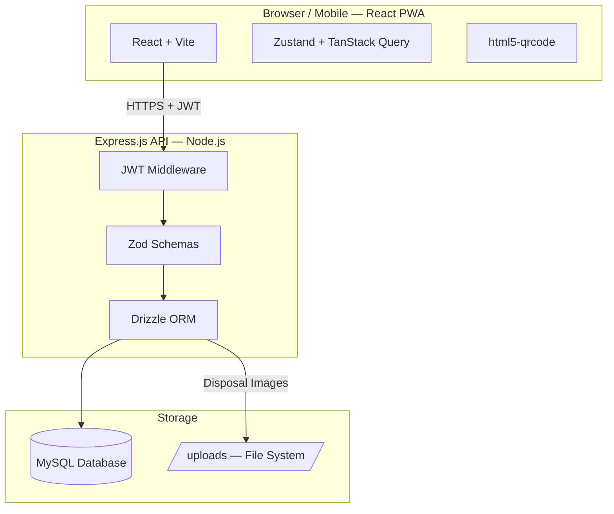

# Architecture Document — Asset Tracker PWA

## Overview
Two-service architecture: a React PWA frontend and an Express.js REST API backend, communicating over HTTP with JSON. Data is stored in MySQL accessed via Drizzle ORM. Authentication is stateless using JWT.

## Architecture Diagram

## Frontend
- **Framework**: React + TypeScript, bundled with Vite
- **Styling**: Tailwind CSS + shadcn/ui
- **State**: Zustand (auth), TanStack Query (server data)
- **Routing**: React Router v6 with role-based route guards
- **PWA**: `vite-plugin-pwa` + Workbox service worker (NetworkFirst for API, CacheFirst for assets)
- **Barcode Scan**: `html5-qrcode` via custom `useQRScanner` hook
- **Barcode Generate**: `JsBarcode` rendered as SVG with PNG download and print support
- **API**: Single Axios instance with JWT request interceptor and 401 auto-logout

## Backend
- **Server**: Express.js + TypeScript
- **Database**: MySQL + Drizzle ORM (schema-as-code, migration support)
- **Auth**: JWT — signed on login, verified via middleware on every request
- **Validation**: Zod schemas on all request bodies
- **Passwords**: bcrypt with work factor 12
- **File Uploads**: Multer — images only, 5MB max, stored in `/uploads/disposals/`
- **Pattern**: Thin route controllers → service layer → Drizzle queries

## Database Tables
| Table | Purpose |
| :--- | :--- |
| **users** | Accounts with role (admin / user) |
| **locations** | Self-referential hierarchy (campus → shelf) |
| **assets** | Fixed and consumable assets with current state |
| **asset_movements** | Immutable audit log of location changes |
| **asset_usages** | Immutable audit log of quantity changes |

## Roles & Access
| Layer | Admin | User |
| :--- | :--- | :--- |
| **All asset APIs** | Yes | No |
| **Scan lookup** | Yes | Yes |
| **Update location / usage** | Yes | Yes |
| **Users / Locations APIs** | Yes | No |

## Key Design Decisions
- **Audit tables** (movements, usages) are append-only — never updated or deleted.
- **Current asset state** (location, quantity) stored directly on the asset row for fast reads.
- **JWT is stateless** — no server-side session storage.
- **All env vars validated** at startup with Zod — server refuses to start if config is incomplete.

## Dev Setup (Quick Reference)
- **Frontend** → http://localhost:5173
- **Backend** → http://localhost:3000
- **Database** → MySQL (local)
- **Run** → `npm run dev` (from monorepo root)
