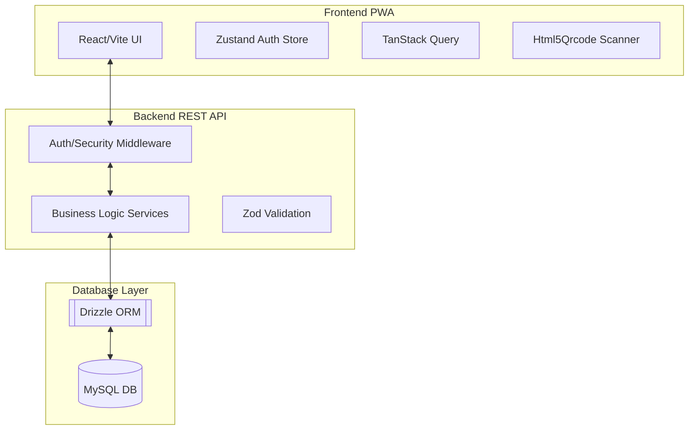

# System Architecture Document
## Project: Asset & Consumable Tracker

### 1. High-Level Architecture
The system follows a **Monorepo Architecture** with a clear separation between the **Client-Side (PWA)** and **Server-Side (REST API)**.

### 2. Technology Stack
- **Frontend**: 
    - Framework: React (TypeScript)
    - Build Tool: Vite
    - Styling: Tailwind CSS
    - PWA: `vite-plugin-pwa`
    - State Management: Zustand
    - Data Fetching: TanStack Query (React Query)
- **Backend**:
    - Runtime: Node.js
    - Framework: Express.js (TypeScript)
    - Security: Helmet, CORS, JWT
    - Validation: Zod
- **Database**:
    - Engine: MySQL
    - ORM: Drizzle ORM (Type-safe SQL)

### 3. Key Technical Workflows

#### 3.1 Authentication Flow
1. User submits credentials via `LoginPage`.
2. Backend validates with `bcryptjs` and returns a JWT.
3. `authStore` persists JWT in `localStorage`.
4. All subsequent API calls include the Bearer Token in headers.

#### 3.2 Asset Lifecycle & State Machine
- **Active State**: Eligible for scanning, translocation, and consumption.
- **Disposed State**: Triggered manually by Admin or automatically via `updateUsage` when quantity hits 0.
- **Scanning Block**: The `AssetService` intercepts scan requests for disposed assets and returns a 404, preventing interaction with decommissioned items.

#### 3.3 Git Workflow & Quality Gates
- **Husky Hooks**:
    - `pre-commit`: Runs `lint-staged` which triggers project-wide `tsc` (backend) and `eslint` (frontend).
    - `pre-push`: Runs a full production build to ensure no regression.

### 4. Data Model
- **`assets`**: Core metadata, type differentiation (fixed/consumable), and current status.
- **`asset_movements`**: Immutable log of location changes.
- **`asset_usages`**: Granular tracking of volumetric consumption for consumables.
- **`users`**: RBAC-enabled user accounts.
- **`system_logs`**: (Logical) Aggregate view of movements and usages for the Activity Stream.
